1. Создать поток.
Родительский и дочерний потоки вывели на экран по 5
строк текста.
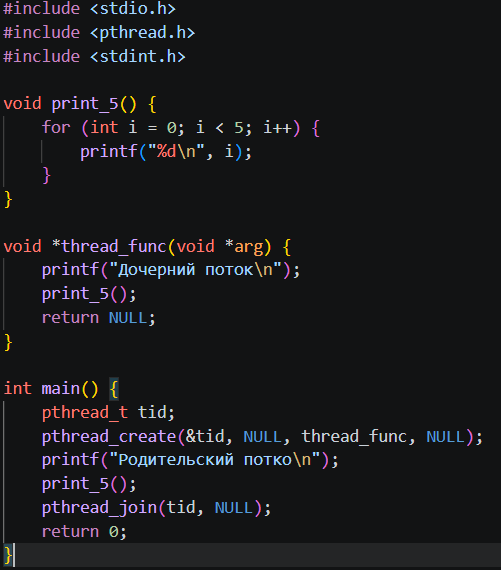
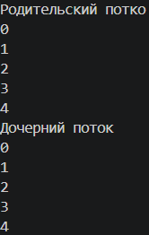
2. Ожидание потока.
Модифицировано упр.1 так, что родительский поток выводит текст
после завершения дочернего потока (с помощью pthread_join()).
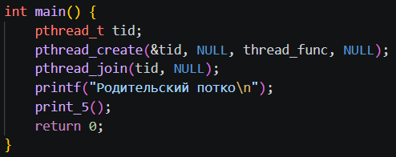
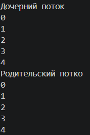
3. Параметры потока
Основной поток создает 4 потока,
исполняющих одну и ту же функцию, что печатает последовательность
текстовых строк, переданных как параметр.
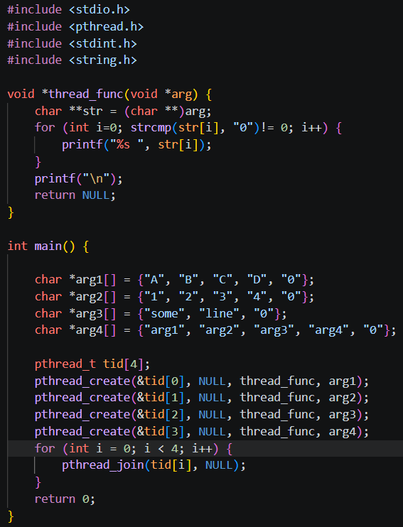
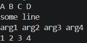
4. Завершение нити без ожидания
Добавлен сон с помощью sleep() в функцию потоков между выводами
строк. Спустя две секунды после создания дочерних потоков
основной поток должен прервать работу всех дочерних потоков с
помощью pthread_cancel().
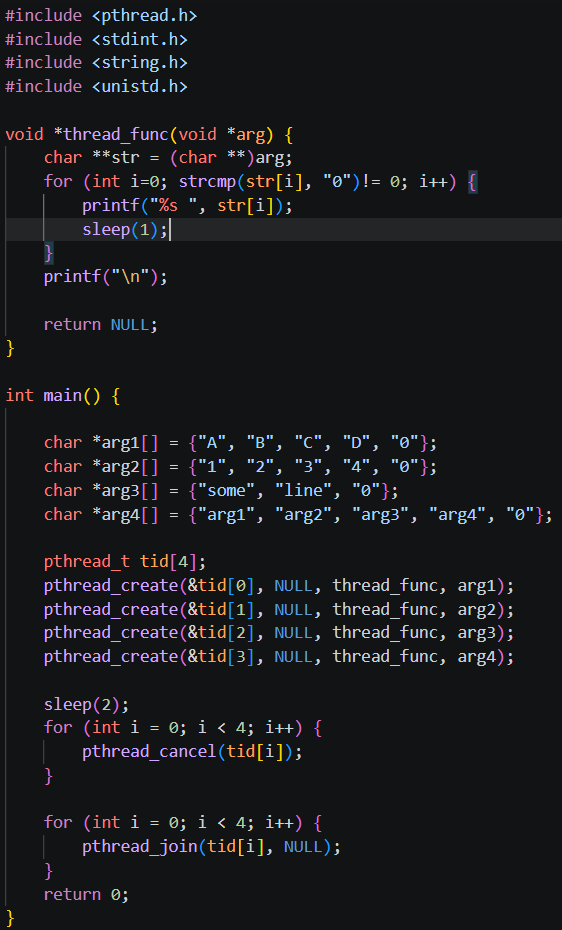
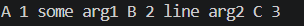
5. Обработать завершение потока
Дочерний поток перед завершением
распечатывает сообщение об этом. Выполнено, используя
pthread_cleanup_push()
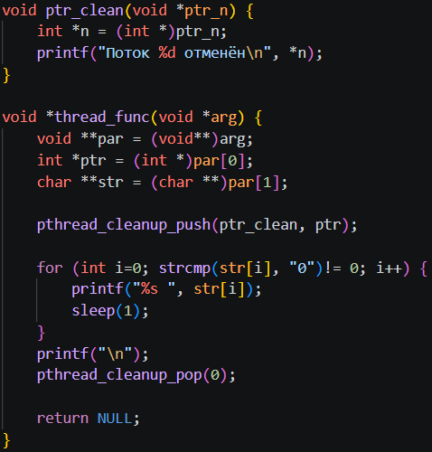
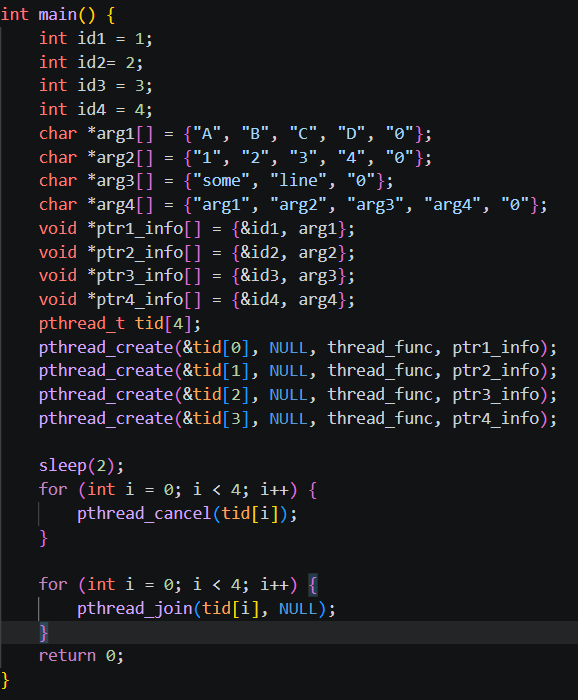
6. Реализовать простой Sleepsort
Реализован прикольный (очень) алгоритм сортировки Sleepsort с
асимптотикой O(N) (по времени). Суть алгоритма: на вход подается
массив, пусть будет не более 50 элементов и пусть будет состоять
из целочисленных значений. Для каждого элемента массива
создается отдельный поток, в который в качестве аргумента
передается значение элемента. Сам поток должен уйти в сон с
помощью sleep() или usleep() с параметром равным аргументу потока
(значение элемента массива), а после вывести на экран значение.
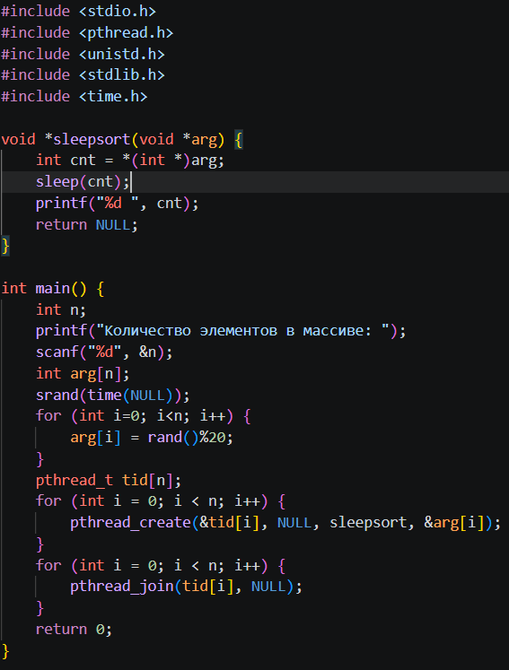
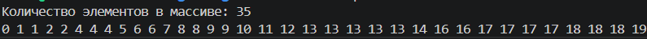
7. Синхронизированный вывод
Вывод родительского и
дочернего потока был синхронизован: сначала родительский поток
выводить первую строку, затем дочерний, затем родительский
вторую строку и т.д. Использован mutex.
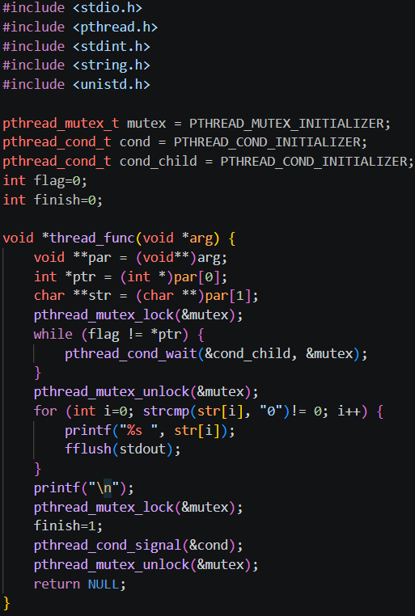
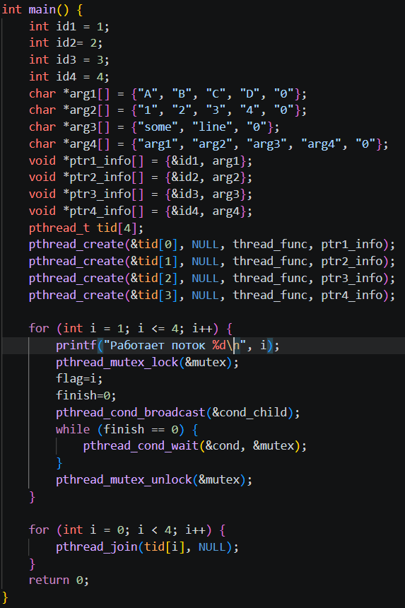
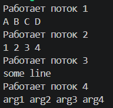
8. Перемножение квадратных матриц NxN
a. Написана функция произведения двух квадратных матриц A и B
размером NxN (на выходе получим матрицу C). Исходные матрицы
A и B заполнить единицами в основном потоке с функцией main.
Для матриц размером меньше 5 в основном потоке выводится на
экран матрицы A, B и C (для проверки правильности работы
функции).
b. С командной строки считываем размер матрицы и количество потоков.
Распараллеляем перемножение матриц разбив матрицу на равные
части между потоками в главной функции по следующему
принципу: N / threads, например если размер матрицы N = 8, а
потоков 4, то каждый из потоков заберет вычисление N/4 = 2
строки и столбца
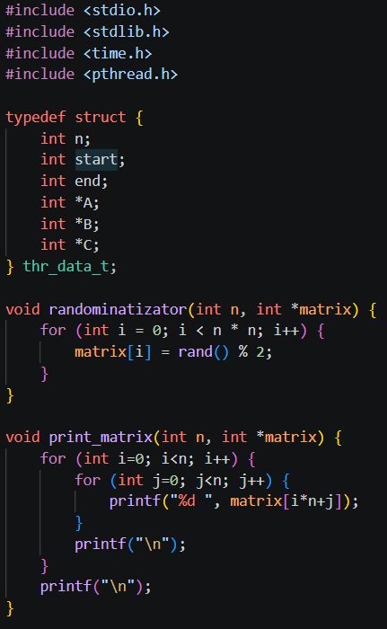
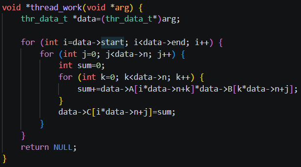
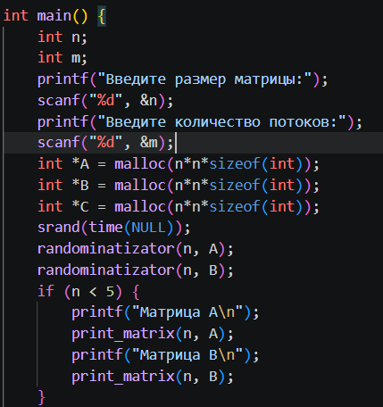
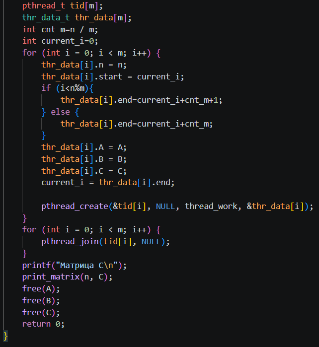
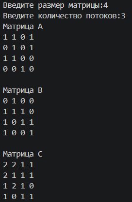
9. Время выполнения
Замерил время выполнения с момента создания потоков (до цикла с
pthread_create) и до завершения работы потоков (после цикла
pthread_join). 
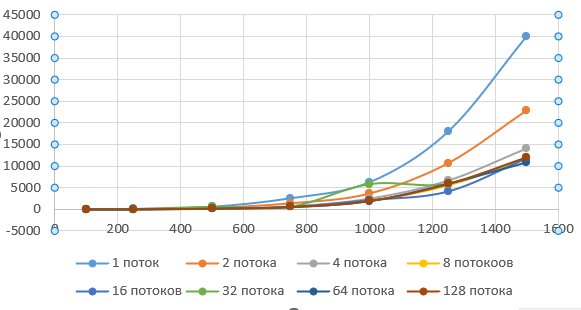