# -Programming-course
Лаба №9 на 3

С помощью git status узнал, что нахожусь на ветке main. git log выводит журнал коммитов в репозитории.

Создал файл sort.c

sort.c  не добавлен
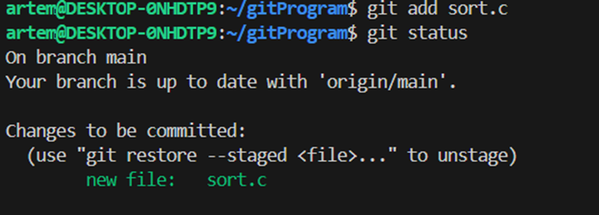
Добавил sort.c, о чём говорит git status

Сделал commit, о чём говорит git status

Добавил комментарий в файл sort.c, git status говорит что файл изменён, но изменение не добавлено, что далее я исправляю.
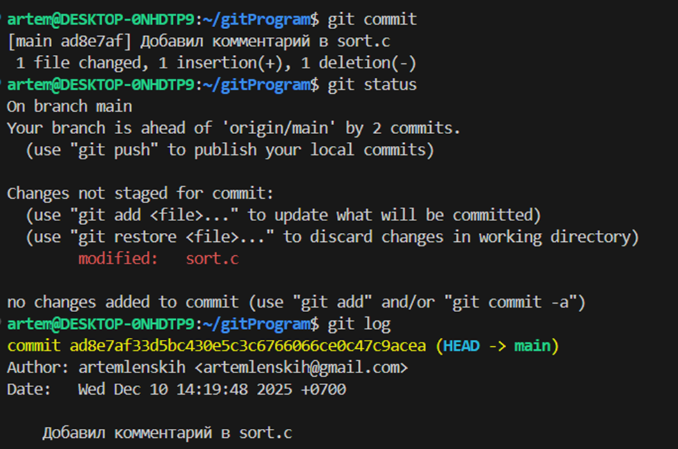
Изменил файл, но не добавил изменения, о чем говорит git status
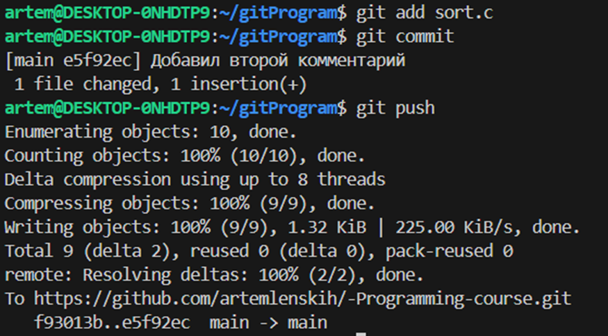
Добавил изменения, закоммител и запушил на удаленный репозиторий. 
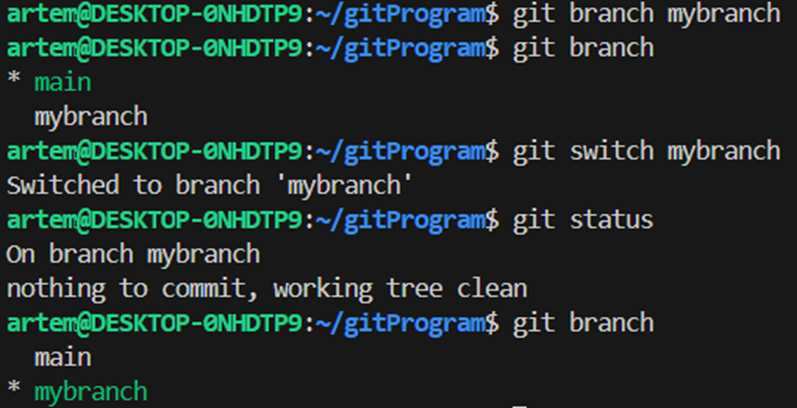
Создал новую ветку, проверил на какой ветке нахожусь, переключил на созданную ветку, git status говорит, что я нахожусь на ветке mybranch и она пуста. git branch говорит, что нахожусь на новой ветке
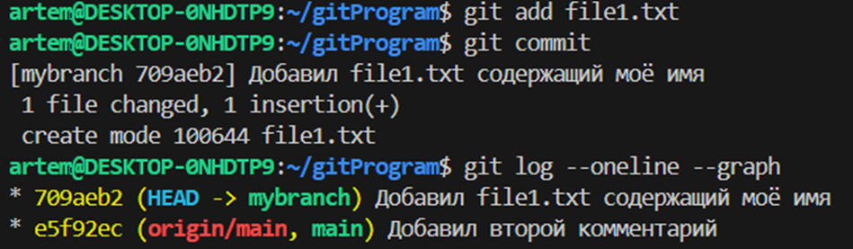
Создал file1.txt добавил его в stage, закоммитил, git log --oneline –graph говорит, что коммит сделан в ветке mybranch
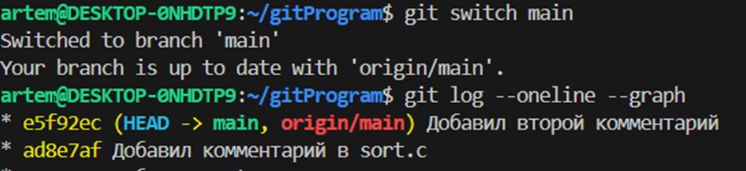
Переключился на ветку main, git log --oneline –graph показывет коммиты, сделанные на текущей ветке
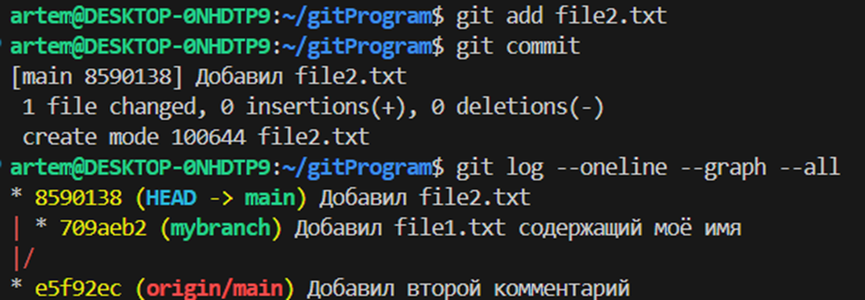
Создал file2.txt, добавил и закоммитил его. 
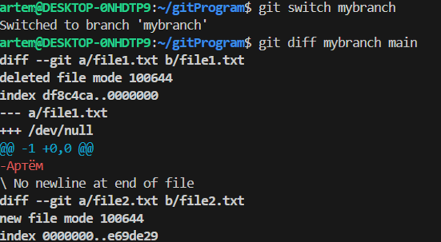
Лаба №9 на 4

Переключил на ветку main. git diff показывает изменения в файле. 

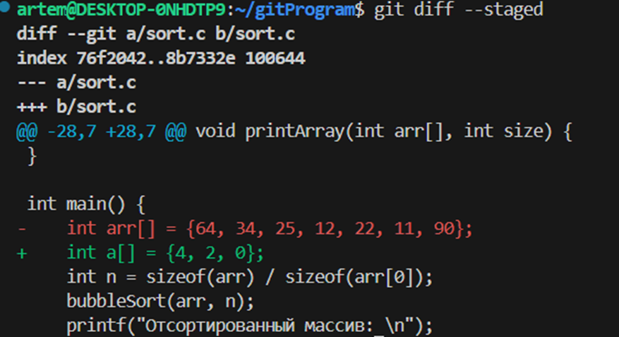
git sdiff –staged показывает разность между добавленными изменениями и последним коммитом.

git diff показывает разницу между изменениями и тем, что добавлено в stage.
git sdiff –staged показывает разность между добавленными изменениями и последним коммитом (Так как не добавил текущие изменеия, то показывает изменеия с предыдущего пункта). 

git restore --staged sort.c удаляет добавленные изменеия из stage.

git restore sort.c отменил все локальные изменения.

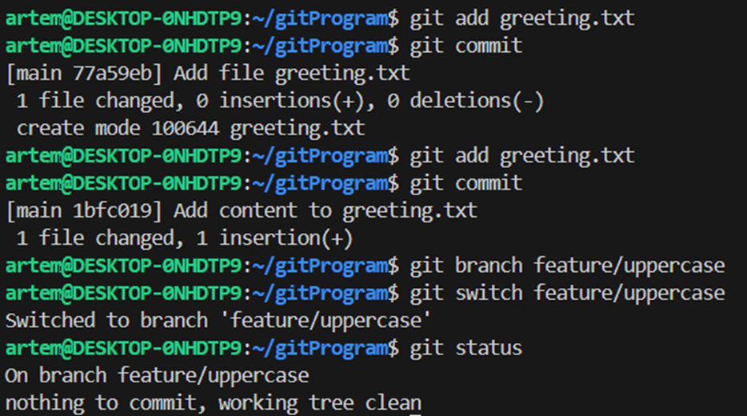
Git status говорит, что я нахожусь в ветке feature/uppercase и коммитов на этой ветке ещё не было. 
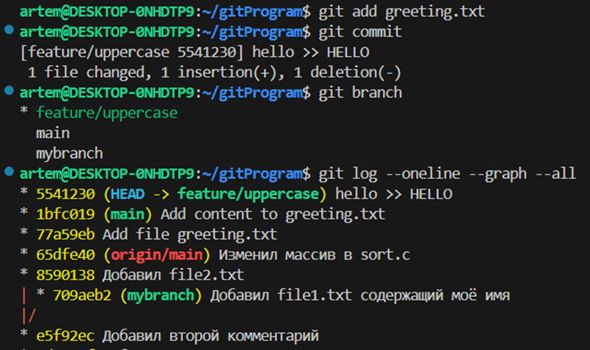
Git branch показывает, что я нахожусь на ветке feature/uppercase. git log --oneline --graph --all строит график коммитов на всех ветках.

Объединил ветки main и feature/uppercase, после чего удалил ветку feature/uppercase.

Смержил ветки main und mybranch. Команда git log --oneline --graph --all выводит графическое представление истории всех веток репозитория в компактном формате.